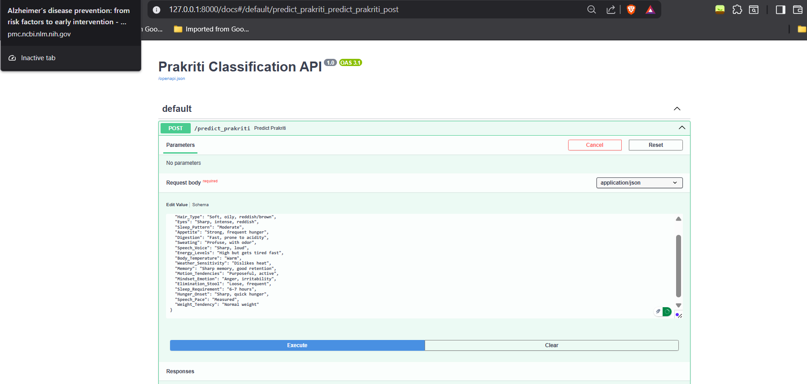
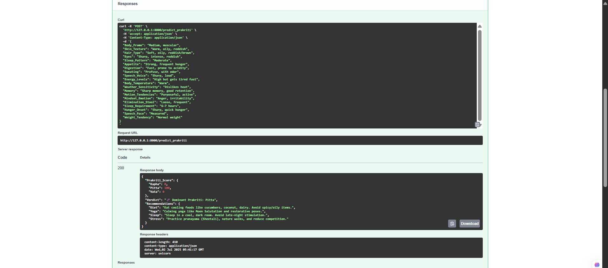
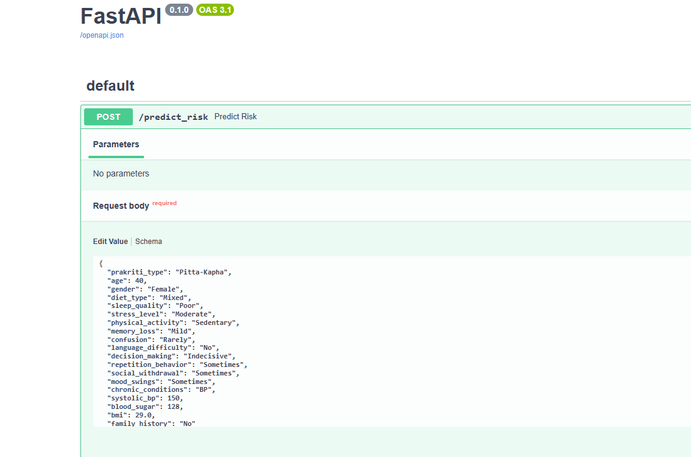
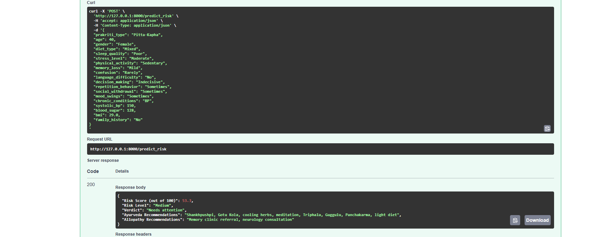

# 🧠 Care Catalyst : Early Alzheimer Detection using Fusion of Ayurveda + Modern Science + ML 🌿

A unique 2-stage machine learning pipeline that combines **Ancient Ayurvedic principles** with **Modern Medical Science** to provide an early screening tool for **Alzheimer's risk prediction**.


## 👥 Team Project Overview

This project was developed during **Hackathon 2.0 (AI/ML in Healthcare)** at  
📍 *Parul Institute of Engineering and Technology*

🧠 **Team Name:** Care Catalyst  
👩‍💻 **Machine Learning Module by:** Ankita Vineshbhai Gohil

> This repository contains the **complete ML pipeline, model training, and backend API integration** done by Ankita(ME)  as part of the team.

---

## 🔍 What It Does

### 🧪 Stage 1 – Prakriti Classification
- Predicts the user’s **Ayurvedic body constitution**: *Vata, Pitta, or Kapha*
- Based on features like body type, digestion, sleep pattern, emotions, etc.

### 🧠 Stage 2 – Alzheimer’s Risk Prediction
- Combines **Prakriti** + **Lifestyle & Cognitive features**
- Outputs a **risk score**, **risk level**, and both **Ayurvedic** & **Allopathic** recommendations

---

## 🛠️ Tech Stack

| Component      | Stack Used                 |
|----------------|----------------------------|
| ML Models      | Scikit-learn, Pandas, NumPy |
| Backend API    | FastAPI                    |
| Frontend (WIP) | ReactJS + TailwindCSS      |
| Format         | `.pkl`, `.csv`, `.ipynb`   |

---

## 📂 Folder Structure
fusion-care-alzheimer-ml/
├── stage_1_prakriti_classification/
│ ├── data/
│ ├── models/
│ ├── notebooks/
├── stage_2_alzheimer_risk_prediction/
│ ├── models/
│ ├── notebooks/
├── apis/
│ ├── Stage1.py
│ └── Stage2.py
├── requirements.txt
└── README.md

## 🚀 How to Run This Project

## 🧪 Run Locally
1. Clone the repo  
```bash
git clone https://github.com/Avgohil/fusion-care-alzheimer-ml.git
pip install -r requirements.txt
```
2.🧠 Run the FastAPI backend
uvicorn apis.Stage1:app --reload
uvicorn apis.Stage2:app --reload

!!<Make sure all .pkl files are in their correct models/ folders.>
### Stage 1 API Output (PrakritiType Prediction) :



### Stage 2 API Output (RiskScore & RiskLevel Prediction With Recommendations) :



## 🔮 Future Scope

🧘 Yoga + Diet Plan API based on Prakriti

🤖 Convert into real-time chatbot using LLMs

🗣️ Speech Analysis for Cognitive Health

👁️ Eye Movement Tracking

😊 Emotion + Sentiment Detection

🎙️ Real-Time Voice Assistant

🌐 Multilingual & Vernacular Support

## 🧠 Why This Matters

India lacks preventive tools combining mental health + traditional insights.

This project bridges that gap by making AI interpretable via Ayurveda.

## 📌 Disclaimer

This project is for research & academic purposes.

Not intended for clinical diagnosis. Always consult a licensed practitioner.

## 💖 Inspired By

This project is deeply inspired by the timeless wisdom of Ayurveda and the cutting-edge innovation in AI:

- 📜 *Charaka Samhita* – Ancient Ayurvedic principles on health, balance & diagnosis  
- 🧠 Modern advancements in AI for early disease detection, especially in neurology  
- 🤝 Hackathons, late-night brainstorming, and our shared curiosity for combining tradition with technology  


