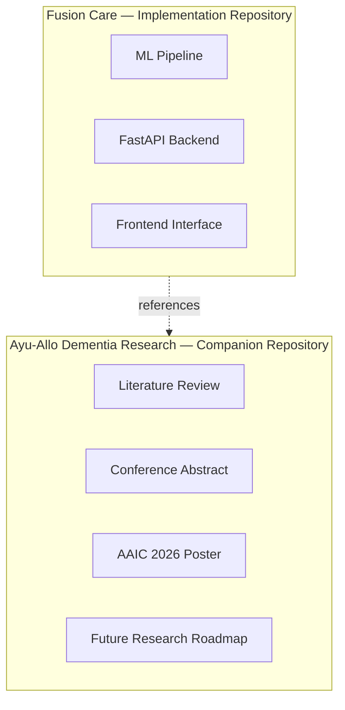
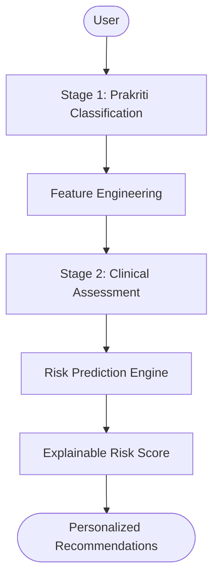
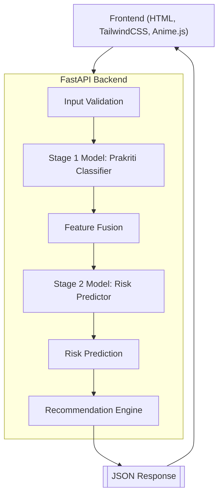
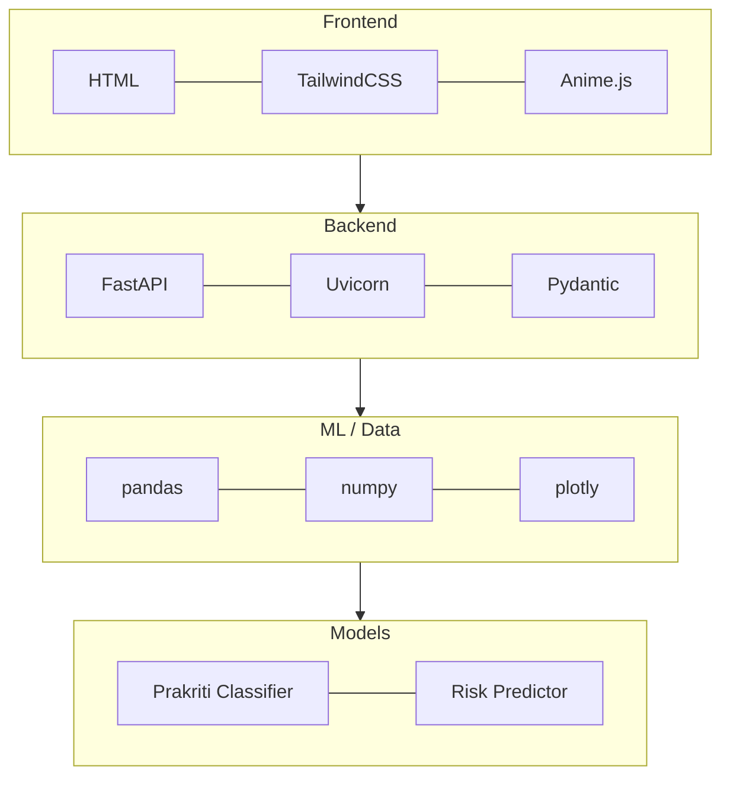
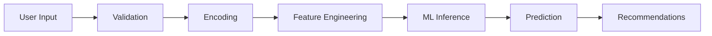
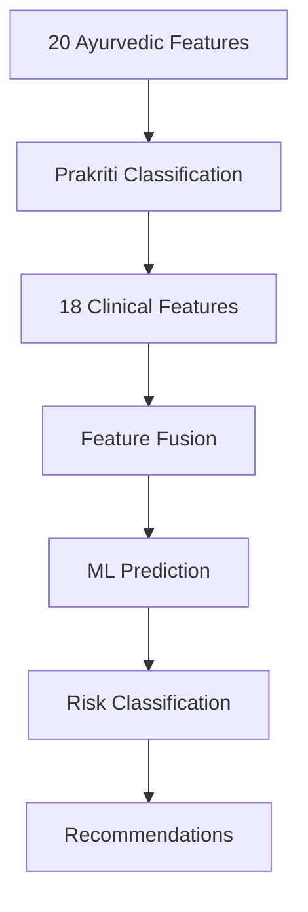
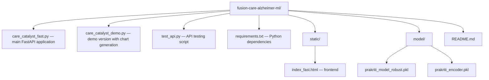
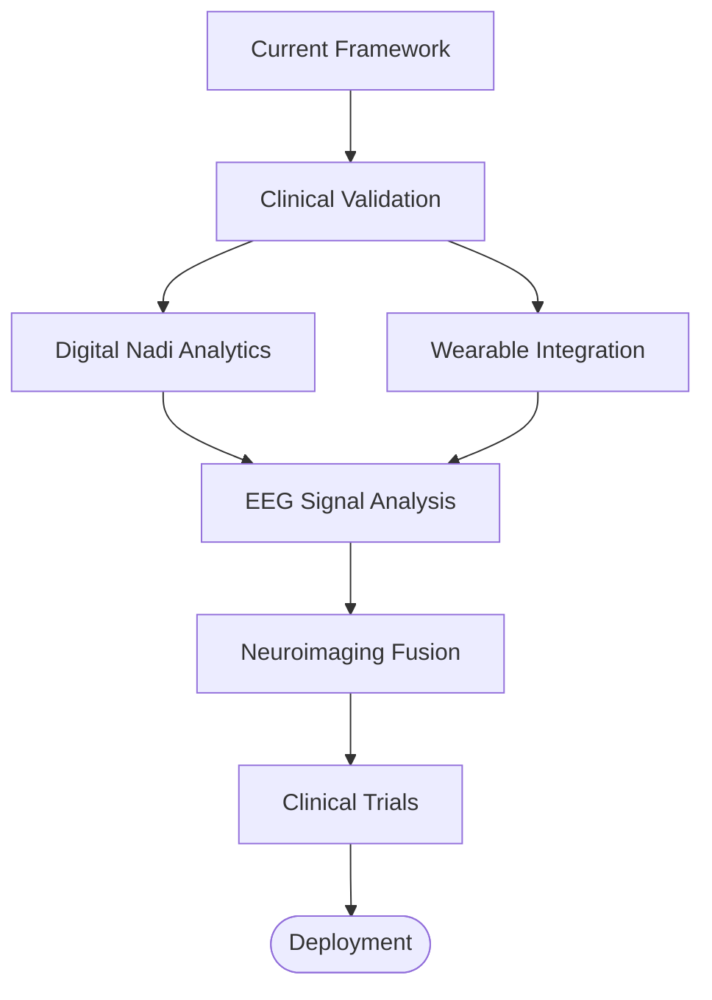

<p align="center">
  
</p>

# Fusion Care

AI-based framework for early Alzheimer's disease risk assessment, integrating Ayurvedic constitutional phenotyping with clinical and lifestyle data.

**Presented at the Alzheimer's Association International Conference (AAIC) 2026** — Virtual Poster.

**Repository type:** Implementation. Research background, literature review, and the conference poster are maintained in the companion repository: [Ayu-Allo Dementia Research](https://github.com/Avgohil/Ayu-Allo-Dementia-Research).

<p align="left">
  
  
  
  
  
  
  
</p>

## Research Summary

| Category | Details |
|---|---|
| Domain | Healthcare AI, Clinical Decision Support |
| Conference | AAIC 2026 (Virtual Poster) |
| Framework | Two-stage AI/ML pipeline |
| Stage 1 | Ayurvedic Prakriti classification (rule-based, 20 features) |
| Stage 2 | Alzheimer's risk prediction (factor-weighted scoring, 18 features) |
| Backend | FastAPI |
| Repository role | Implementation (ML pipeline + backend) |
| Research companion | [Ayu-Allo Dementia Research](https://github.com/Avgohil/Ayu-Allo-Dementia-Research) |

## Why Fusion Care

Alzheimer's disease is typically diagnosed after substantial neurological damage has occurred, at a stage where intervention options are limited. Screening approaches that are inexpensive and usable earlier in the disease course have value for early-intervention research, independent of whether they meet diagnostic standards on their own.

Two design choices follow from that premise.

**Explainability.** A risk output is only useful if its contributing factors are visible. Stage 2 uses interpretable, factor-based scoring — age, cognitive symptoms, lifestyle, clinical markers, family history — so a result can be traced to its inputs rather than treated as an opaque score.

**Ayurvedic phenotyping as a complementary signal.** Prakriti (constitutional typing) is a longstanding framework for characterizing physiological and behavioral tendencies. It is not a validated biomarker for Alzheimer's risk. This project treats it as an additional phenotypic layer worth testing computationally alongside clinical data, not as a claimed diagnostic mechanism. Clinical validation of this hypothesis is listed under Future Research, not claimed here.

## Overview

Fusion Care is a two-stage AI/ML framework for early Alzheimer's disease risk assessment. It combines **Ayurvedic constitutional phenotyping (Prakriti)** with **modern clinical and lifestyle evaluation** to produce personalized risk predictions and recommendations.

The architecture is designed to extend toward wearable sensors, digital biomarkers, EEG signals, neuroimaging, and digital Nadi (pulse) analytics as the research matures.

## My Contribution

This repository contains the AI/ML pipeline and FastAPI backend, which I designed and implemented: model development, feature engineering, data processing, API design, and performance optimization. The frontend interface was developed collaboratively with teammates during the original hackathon; this repository documents the ML and backend components specifically.

## Research Companion

This repository contains the implementation. The companion repository, [Ayu-Allo Dementia Research](https://github.com/Avgohil/Ayu-Allo-Dementia-Research), contains:

- Literature review and research background
- AAIC 2026 poster
- Conference abstract
- References
- Future research roadmap


```mermaid
flowchart TD
    subgraph Implementation ["Fusion Care — Implementation Repository"]
        ML[ML Pipeline]
        API[FastAPI Backend]
        UI[Frontend Interface]
    end

    subgraph Research ["Ayu-Allo Dementia Research — Companion Repository"]
        LIT[Literature Review]
        ABS[Conference Abstract]
        POST[AAIC 2026 Poster]
        FUT[Future Research Roadmap]
    end

    Implementation -. references .-> Research
```

## Hackathon Context

Fusion Care originated as the Care Catalyst hackathon project. This repository documents the machine learning pipeline and backend architecture: model development, feature engineering, FastAPI design, and performance work. The full-stack hackathon build additionally included a frontend (TailwindCSS, Anime.js), developed collaboratively by the team, and deployment infrastructure that is outside this repository's scope.

## Features

**Stage 1 — Ayurvedic Prakriti Classification**
- Analyzes 20 physical and behavioral characteristics
- Determines constitution (Vata, Pitta, Kapha, or a combination)
- Produces Ayurvedic recommendations corresponding to the determined type

**Stage 2 — Alzheimer's Risk Prediction**
- Evaluates 18 health and lifestyle factors
- Generates a risk score (0–100) with Low / Medium / High classification
- Combines Prakriti type with modern clinical indicators

**Interface**
- Multi-step form with progressive disclosure
- Animated, CSS-based risk gauge (replaces earlier server-side Plotly image generation)
- Responsive layout, real-time input validation

## Technical Leadership

**Machine learning**
- Designed the two-stage assessment pipeline
- Built the Ayurvedic Prakriti classifier (20+ features)
- Built the Alzheimer's risk model (18 health indicators)

**Backend architecture and performance**
- Designed the FastAPI backend and its endpoints
- Reduced response time from approximately 30s to under 1s by replacing server-side Plotly image generation with CSS-based charts
- Implemented input validation and error handling

**Data engineering**
- Built preprocessing pipelines for Ayurvedic and clinical inputs
- Designed feature engineering across both assessment stages
- Implemented data encoders and model serialization

## Screenshots

| Screen | Suggested placement |
|---|---|
| Home page | Below this table |
| Stage 1 assessment (Prakriti form) | Under Features → Stage 1 |
| Stage 2 assessment (clinical form) | Under Features → Stage 2 |
| Prediction results (risk gauge, recommendations) | Under Features → Interface |
| API documentation (`/docs`) | In API Documentation, before the request/response examples |
| AAIC poster preview (cropped) | In Recognition, above the Research Summary table |

For the AAIC poster specifically, crop and reuse individual panels rather than inserting the full poster: the workflow diagram, the architecture diagram, the results panel, and the research-highlights panel each work as standalone figures at README width; the full poster does not.

## System Workflow


```mermaid
flowchart TD
    U([User]) --> S1[Stage 1: Prakriti Classification]
    S1 --> FE[Feature Engineering]
    FE --> S2[Stage 2: Clinical Assessment]
    S2 --> RPE[Risk Prediction Engine]
    RPE --> ERS[Explainable Risk Score]
    ERS --> REC([Personalized Recommendations])
```

## Technical Architecture


```mermaid
flowchart TD
    FE["Frontend (HTML, TailwindCSS, Anime.js)"] --> BE

    subgraph BE ["FastAPI Backend"]
        VAL[Input Validation] --> M1[Stage 1 Model: Prakriti Classifier]
        M1 --> FUS[Feature Fusion]
        FUS --> M2[Stage 2 Model: Risk Predictor]
        M2 --> RP[Risk Prediction]
        RP --> RE[Recommendation Engine]
    end

    RE --> JSON[["JSON Response"]]
    JSON --> FE
```

**Backend:** `care_catalyst_fast.py` — `/predict` (POST, main assessment endpoint), `/` (GET, serves frontend), `/static/*` (static file serving)

**Frontend:** `static/index_fast.html` — TailwindCSS for styling, Anime.js for animation, vanilla JS for form handling and API communication

**Technical stack**


```mermaid
flowchart TD
    subgraph Frontend
        direction LR
        HTML --- TW[TailwindCSS] --- AJS[Anime.js]
    end
    subgraph Backend
        direction LR
        FAPI[FastAPI] --- UV[Uvicorn] --- PYD[Pydantic]
    end
    subgraph MLData ["ML / Data"]
        direction LR
        PD[pandas] --- NP[numpy] --- PLT[plotly]
    end
    subgraph Models
        direction LR
        PRK[Prakriti Classifier] --- RSK[Risk Predictor]
    end

    Frontend --> Backend --> MLData --> Models
```

**Data flow**


```mermaid
flowchart LR
    A[User Input] --> B[Validation] --> C[Encoding] --> D[Feature Engineering] --> E[ML Inference] --> F[Prediction] --> G[Recommendations]
```

## Assessment Logic

**Assessment pipeline**


```mermaid
flowchart TD
    A["20 Ayurvedic Features"] --> B[Prakriti Classification]
    B --> C["18 Clinical Features"]
    C --> D[Feature Fusion]
    D --> E[ML Prediction]
    E --> F[Risk Classification]
    F --> G[Recommendations]
```

**Prakriti classification** uses rule-based scoring: it analyzes key characteristics (body frame, skin, hair, and related traits), assigns points to each dosha based on responses, determines the dominant constitution or mixed type, and returns recommendations appropriate to that type.

**Assessment fields**

Ayurvedic constitution (20 fields): physical (body frame, skin texture, hair type, eyes), physiological (sleep pattern, appetite, digestion, sweating), behavioral (speech, energy levels, memory, motion tendencies), environmental (body temperature, weather sensitivity).

Health assessment (18 fields): demographics (age, gender), lifestyle (diet, sleep quality, stress level, physical activity), cognitive (memory loss, confusion, language difficulty, decision making), behavioral (repetition, social withdrawal, mood swings), medical (blood pressure, blood sugar, BMI, family history, chronic conditions).

**Risk score calculation**

```python
# Age factors
age > 65: +10 points
age > 55: +5 points

# Cognitive symptoms
memory_loss: 0-20 points
confusion: 0-15 points
language_difficulty: 0-10 points

# Lifestyle factors
poor_sleep: +5 points
high_stress: +5 points
low_activity: +5 points

# Health indicators
systolic_bp > 140: +8 points
blood_sugar > 126: +8 points
bmi > 30: +6 points

# Family history: +15 points
```

Risk levels: Low (0–40, "Healthy but monitor"), Medium (41–60, "Needs attention"), High (61–100, "High risk, take action").

## Project Structure


```mermaid
flowchart TD
    Root["fusion-care-alzheimer-ml/"]
    Root --> A[care_catalyst_fast.py — main FastAPI application]
    Root --> B[care_catalyst_demo.py — demo version with chart generation]
    Root --> C[test_api.py — API testing script]
    Root --> D[requirements.txt — Python dependencies]
    Root --> E[static/]
    E --> E1[index_fast.html — frontend]
    Root --> F[model/]
    F --> F1[prakriti_model_robust.pkl]
    F --> F2[prakriti_encoder.pkl]
    Root --> G[README.md]
```

```
fusion-care-alzheimer-ml/
├── care_catalyst_fast.py      # Main FastAPI application
├── care_catalyst_demo.py      # Demo version with chart generation
├── test_api.py                # API testing script
├── requirements.txt           # Python dependencies
├── static/
│   └── index_fast.html        # Frontend application
├── model/
│   ├── prakriti_model_robust.pkl
│   └── prakriti_encoder.pkl
├── assets/
│   └── banner.png
└── README.md
```

## Quick Start

**Prerequisites:** Python 3.8+, pip

**Installation**

```bash
git clone https://github.com/Avgohil/fusion-care-alzheimer-ml.git
cd fusion-care-alzheimer-ml
pip install -r requirements.txt
python care_catalyst_fast.py
```

Then open `http://localhost:8003`.

## API Documentation


```mermaid
flowchart LR
    U([User]) --> FE[Frontend]
    FE -->|POST /predict| API[FastAPI]
    API --> M[Model Inference]
    M --> J[["JSON"]]
    J --> FE --> U
```

Full interactive API documentation is available at `/docs` when running locally.

**`POST /predict`**

Request body:
```json
{
  "Body_Frame": "Medium, muscular",
  "Skin_Texture": "Warm, oily, reddish",
  "age": 45,
  "gender": "Male",
  "systolic_bp": 120,
  "blood_sugar": 100,
  "bmi": 23.5
}
```

Response:
```json
{
  "prakriti_result": "Pitta-Vata",
  "prakriti_scores": {"Vata": 35, "Pitta": 45, "Kapha": 20},
  "alzheimer_risk": "Low",
  "risk_score": 25,
  "verdict": "Healthy but monitor",
  "ayurveda_recommendations": "Shankhpushpi, Gotu Kola...",
  "allopathy_recommendations": "Annual wellness exam...",
  "chart_data": {},
  "processing_time": "0.15s"
}
```

## Dependencies

```
fastapi==0.104.1      # Web framework
uvicorn==0.24.0       # ASGI server
pandas==2.1.3         # Data manipulation
numpy==1.25.2         # Numerical computing
plotly==5.17.0        # Interactive charts (optional)
pydantic==2.5.0       # Data validation
```

## Deployment

**Local development**
```bash
python care_catalyst_fast.py
```

**Production (Uvicorn)**
```bash
uvicorn care_catalyst_fast:app --host 0.0.0.0 --port 8000
```

**Docker**
```dockerfile
FROM python:3.9-slim
COPY . /app
WORKDIR /app
RUN pip install -r requirements.txt
CMD ["uvicorn", "care_catalyst_fast:app", "--host", "0.0.0.0", "--port", "8000"]
```

## Testing

```bash
python test_api.py
```

## Future Research


```mermaid
flowchart TD
    A[Current Framework] --> B[Clinical Validation]
    B --> C[Digital Nadi Analytics]
    B --> D[Wearable Integration]
    C --> E[EEG Signal Analysis]
    D --> E
    E --> F[Neuroimaging Fusion]
    F --> G[Clinical Trials]
    G --> H([Deployment])
```

- Nadi Pariksha (pulse diagnosis) integration with IoT sensors for more accurate Prakriti assessment
- Neuroimaging fusion with Ayurvedic assessment for enhanced Alzheimer's prediction
- Deep learning models for EEG/fMRI pattern recognition
- Computer vision for traditional diagnostic methods
- Real-time biometric data fusion
- Database integration, authentication, mobile app, multi-language support, wearable device integration, telemedicine connections, expanded training data

**Timeline:** Literature review → prototype → Care Catalyst hackathon → Fusion Care → AAIC 2026 poster → clinical validation (planned) → future research.

## Contributing

1. Fork the repository
2. Create a feature branch: `git checkout -b feature/amazing-feature`
3. Commit changes: `git commit -m 'Add amazing feature'`
4. Push the branch: `git push origin feature/amazing-feature`
5. Open a pull request

## License

This project is for educational and research purposes. Consult healthcare professionals for medical advice; it is not a diagnostic tool.

## Acknowledgements

- The Ayurveda community, for traditional knowledge and practices
- Open-source libraries: FastAPI, TailwindCSS, Anime.js, Plotly
- Prior healthcare research on Alzheimer's risk factors

---

If this repository contributes to your research or learning, consider citing the work or starring the repository. For the research background, literature review, and AAIC 2026 poster, see the [companion repository](https://github.com/Avgohil/Ayu-Allo-Dementia-Research).
