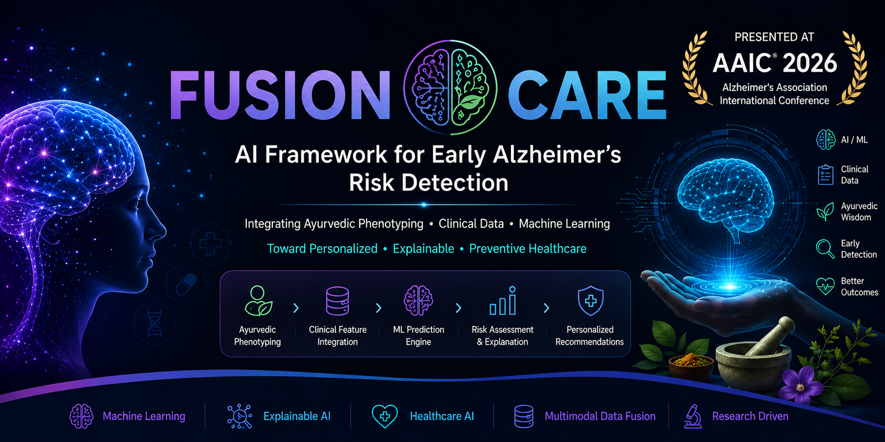
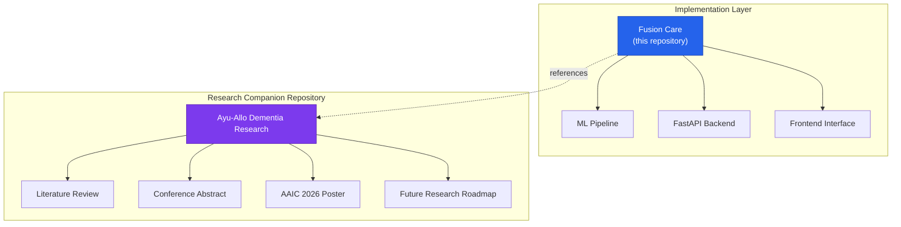
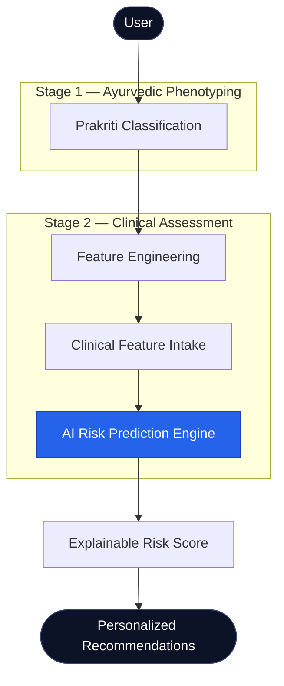
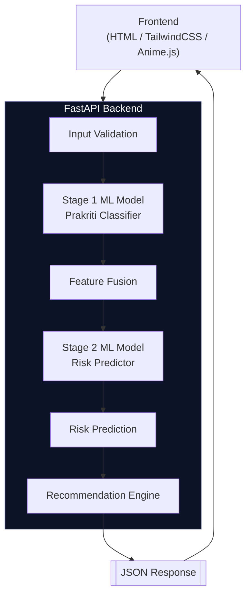
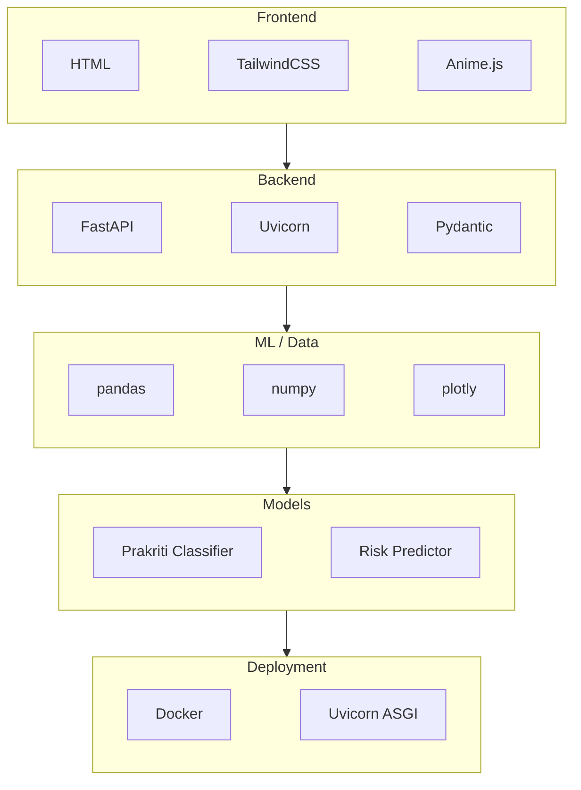
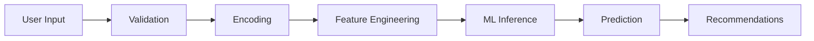
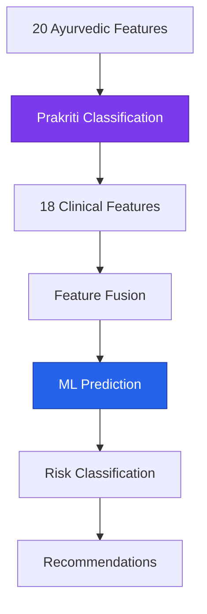
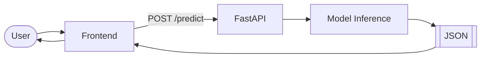
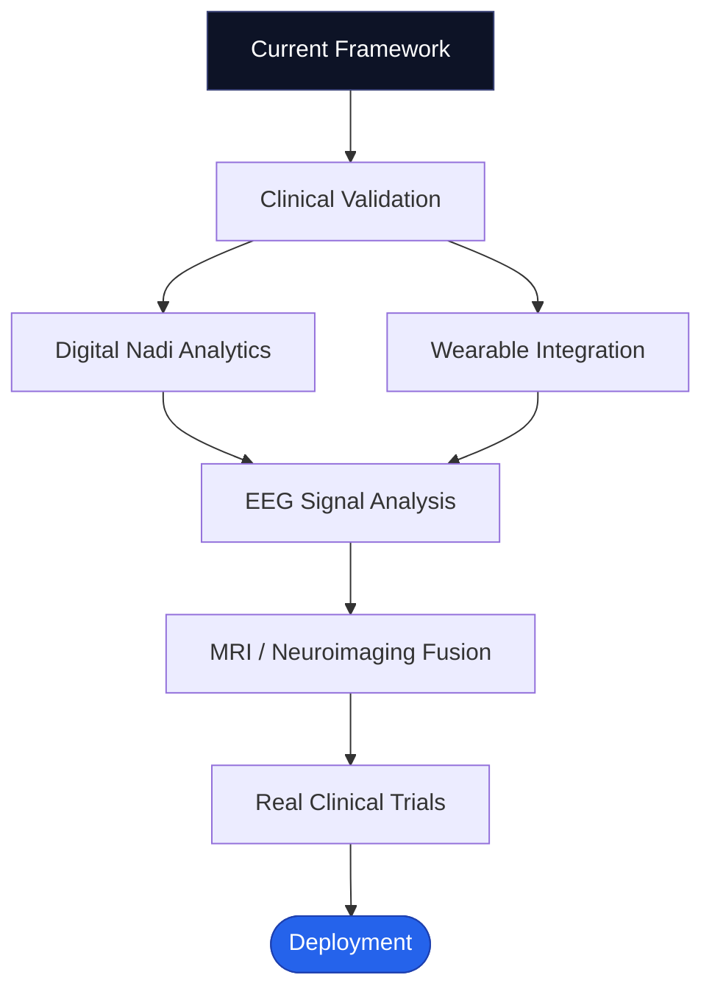

<p align="center">
  
</p>

<h1 align="center">🧠 Fusion Care</h1>

<h3 align="center">
AI-Powered Early Alzheimer's Disease Risk Assessment<br/>
using Ayurvedic Phenotyping &amp; Modern Clinical Intelligence
</h3>

<p align="center">
  <em>Ayurveda × Clinical Intelligence × Machine Learning</em><br/>
  🏆 Presented at AAIC 2026
</p>

<p align="center">
  
  
  
  
  
  
  
  <br/>
  
  
  
</p>

---

## 🏆 Recognition

**Presented at the Alzheimer's Association International Conference (AAIC) 2026**

| | |
|---|---|
| **Presentation Type** | Virtual Poster |
| **Abstract Title** | *A Two-Stage AI/ML Framework Integrating Ayurvedic Phenotyping and Clinical Data for Early Alzheimer's Risk Detection* |

---

## 🧭 Why Fusion Care?

Alzheimer's disease is typically diagnosed after significant neurological damage has already occurred, at a stage where intervention options are limited. Screening tools that are inexpensive, accessible, and usable before clinical symptoms are pronounced have direct value for early intervention research, even when they are not diagnostic in themselves.

Two design choices follow from that premise:

**Explainability over black-box scoring.** A risk score is only useful to a clinician or researcher if the contributing factors are visible. Fusion Care's Stage 2 model is built on interpretable, factor-based scoring (age, cognitive symptoms, lifestyle, clinical markers, family history) specifically so that a risk output can be traced back to *why* it was generated, rather than treated as an opaque number.

**Ayurvedic phenotyping as a complementary signal, not a replacement.** Prakriti (constitutional typing) is a longstanding framework for characterizing individual physiological and behavioral tendencies. It is not a validated biomarker for Alzheimer's risk on its own. Fusion Care treats it as an additional phenotypic layer alongside clinical data — a hypothesis worth testing computationally, not a claimed diagnostic mechanism. This is explicitly framed as exploratory; clinical validation is listed under Future Roadmap, not claimed here.

---

## 🌟 Overview

Fusion Care is a two-stage AI/ML framework for early Alzheimer's disease risk assessment. It integrates **Ayurvedic constitutional phenotyping (Prakriti)** with **modern clinical and lifestyle evaluation**, combining traditional diagnostic knowledge with evidence-based health assessment to produce personalized risk predictions and recommendations.

The architecture is designed to extend toward wearable sensors, digital biomarkers, EEG signals, neuroimaging, and digital Nadi (pulse) analytics as the research matures.

---

## ✨ Key Features

- 🧠 Two-stage AI/ML pipeline for early Alzheimer's disease risk assessment
- 🌿 Ayurvedic Prakriti phenotyping across 20 constitutional characteristics
- 🩺 Modern clinical, cognitive, and lifestyle assessment across 18 factors
- 🤖 Personalized recommendations combining Ayurveda and modern medicine
- ⚡ FastAPI backend with a sub-second prediction pipeline
- 🔬 Extensible architecture for wearables, EEG, neuroimaging, and digital biomarkers

---

## 👩‍💻 My Contribution

This repository contains the **AI/ML pipeline and FastAPI backend** that I designed and built: model development, feature engineering, data processing, API design, and performance optimization. The frontend interface was developed collaboratively with teammates during the original hackathon — this repository documents the ML and backend work specifically.

---

## 📚 Research Companion

This is the **implementation repository**. The accompanying research repository holds the scientific background:

- Literature review and research background
- AAIC 2026 poster
- Conference abstract
- References
- Future research roadmap

**Repository:** [Ayu-Allo Dementia Research](https://github.com/Avgohil/Ayu-Allo-Dementia-Research)

### Repository Ecosystem


```mermaid
flowchart TD
    FC["Fusion Care<br/>(this repository)"]

    subgraph Implementation ["Implementation Layer"]
        FC --> ML[ML Pipeline]
        FC --> API[FastAPI Backend]
        FC --> UI[Frontend Interface]
    end

    subgraph Research ["Research Companion Repository"]
        RR[Ayu-Allo Dementia Research]
        RR --> LIT[Literature Review]
        RR --> ABS[Conference Abstract]
        RR --> POST[AAIC 2026 Poster]
        RR --> FUT[Future Research Roadmap]
    end

    FC -.references.-> RR

    style FC fill:#2563eb,stroke:#1e40af,color:#fff
    style RR fill:#7c3aed,stroke:#5b21b6,color:#fff
```

---

## 🏆 Hackathon Context

Fusion Care originated as the **Care Catalyst** hackathon project. This repository documents the machine learning pipeline and backend architecture I built — model development, data/feature engineering, FastAPI design, and performance work. The full-stack hackathon build additionally included a frontend (TailwindCSS + Anime.js), developed collaboratively by the team, along with deployment infrastructure that isn't part of this repository's scope.

---

## 🎯 Features

### Two-Stage ML Assessment Pipeline

**Stage 1 — Ayurvedic Prakriti Classification**
- Analyzes 20 physical and behavioral characteristics
- Determines constitution: Vata (💨), Pitta (🔥), Kapha (🌿), or a combination
- Produces personalized Ayurvedic recommendations

**Stage 2 — Alzheimer's Risk Prediction**
- Evaluates 18 health and lifestyle factors
- Generates a risk score (0–100) with Low / Medium / High classification
- Combines Prakriti type with modern clinical indicators

### Interface

- Multi-step form with progressive disclosure and visual progress indicators
- Glassmorphism, medical-blue themed design
- Animated CSS-based risk gauge (replaces earlier Plotly image generation)
- Responsive layout for desktop and mobile
- Real-time input validation

---

## 🎯 Technical Leadership

As the ML and backend lead on this project, my work spanned three areas:

**Machine Learning**
- Designed the two-stage assessment pipeline (Prakriti classification → risk prediction)
- Built the Ayurvedic Prakriti classifier across 20+ features
- Built the Alzheimer's risk model across 18 health indicators

**Backend Architecture & Performance**
- Designed the FastAPI backend and its endpoints
- Reduced response time from ~30s to <1s by replacing server-side Plotly image generation with lightweight CSS-based charts
- Implemented data validation and error handling

**Data Engineering**
- Built preprocessing pipelines for both Ayurvedic and clinical inputs
- Designed feature engineering across both assessment stages
- Implemented data encoders and model serialization

---

## 📸 Screenshots

| # | Screen | Suggested placement |
|---|--------|---------------------|
| 1 | Home page | Below this table — sets first impression of the app |
| 2 | Stage 1 assessment (Prakriti form) | In "Features → Two-Stage ML Assessment Pipeline," under the Stage 1 description |
| 3 | Stage 2 assessment (clinical form) | Same subsection, under the Stage 2 description |
| 4 | Prediction result (risk gauge + recommendations) | In "Features → Interface," under the animated risk gauge bullet |
| 5 | API documentation (`/docs` Swagger UI) | In the API Documentation section, above the request/response examples |
| 6 | AAIC poster preview (cropped) | In Recognition, replacing the poster-crop placeholder |

> 🖼️ *Insert Screenshot 1 (Home Page) here.*

---

## 🔀 System Workflow


```mermaid
flowchart TD
    U([User]) --> S1

    subgraph Stage1 ["Stage 1 — Ayurvedic Phenotyping"]
        S1[Prakriti Classification]
    end

    S1 --> FE[Feature Engineering]

    subgraph Stage2 ["Stage 2 — Clinical Assessment"]
        FE --> CA[Clinical Feature Intake]
        CA --> RPE[AI Risk Prediction Engine]
    end

    RPE --> ERS[Explainable Risk Score]
    ERS --> REC([Personalized Recommendations])

    style U fill:#0d1326,stroke:#3b4478,color:#fff
    style REC fill:#0d1326,stroke:#3b4478,color:#fff
    style RPE fill:#2563eb,stroke:#1e40af,color:#fff
```

---

## 🏗️ Technical Architecture


```mermaid
flowchart TD
    FE["Frontend<br/>(HTML / TailwindCSS / Anime.js)"] --> BE

    subgraph BE ["FastAPI Backend"]
        VAL[Input Validation]
        VAL --> M1[Stage 1 ML Model<br/>Prakriti Classifier]
        M1 --> FUS[Feature Fusion]
        FUS --> M2[Stage 2 ML Model<br/>Risk Predictor]
        M2 --> RP[Risk Prediction]
        RP --> RE[Recommendation Engine]
    end

    RE --> JSON[["JSON Response"]]
    JSON --> FE

    style BE fill:#0d1326,stroke:#3b4478,color:#fff
```

### Tech Stack


```mermaid
flowchart TD
    subgraph L1 ["Frontend"]
        direction LR
        HTML[HTML] ~~~ TW[TailwindCSS] ~~~ AJS[Anime.js]
    end
    subgraph L2 ["Backend"]
        direction LR
        FAPI[FastAPI] ~~~ UV[Uvicorn] ~~~ PYD[Pydantic]
    end
    subgraph L3 ["ML / Data"]
        direction LR
        PD[pandas] ~~~ NP[numpy] ~~~ PLT[plotly]
    end
    subgraph L4 ["Models"]
        direction LR
        PRK[Prakriti Classifier] ~~~ RSK[Risk Predictor]
    end
    subgraph L5 ["Deployment"]
        direction LR
        DOC[Docker] ~~~ UVD[Uvicorn ASGI]
    end

    L1 --> L2 --> L3 --> L4 --> L5
```

### Data Flow


```mermaid
flowchart LR
    A[User Input] --> B[Validation]
    B --> C[Encoding]
    C --> D[Feature Engineering]
    D --> E[ML Inference]
    E --> F[Prediction]
    F --> G[Recommendations]
```

**Backend (FastAPI):** `care_catalyst_fast.py` — `/predict` (POST, main assessment endpoint), `/` (GET, serves frontend), `/static/*` (static file serving)

**Frontend (Vanilla HTML/JS):** `static/index_fast.html` — TailwindCSS for styling, Anime.js for animation, vanilla JS for form handling and API communication

---

## 🔬 Assessment Logic

### Assessment Pipeline


```mermaid
flowchart TD
    A["20 Ayurvedic Features"] --> B[Prakriti Classification]
    B --> C["18 Clinical Features"]
    C --> D[Feature Fusion]
    D --> E[ML Prediction]
    E --> F[Risk Classification]
    F --> G[Recommendations]

    style B fill:#7c3aed,stroke:#5b21b6,color:#fff
    style E fill:#2563eb,stroke:#1e40af,color:#fff
```

### Prakriti Classification

Rule-based scoring:
- Analyzes key characteristics (body frame, skin, hair, etc.)
- Assigns points to each dosha based on responses
- Determines the dominant constitution or mixed type
- Returns recommendations appropriate to the determined type

### Assessment Fields

**Ayurvedic Constitution (20 fields)**
- Physical: body frame, skin texture, hair type, eyes
- Physiological: sleep pattern, appetite, digestion, sweating
- Behavioral: speech, energy levels, memory, motion tendencies
- Environmental: body temperature, weather sensitivity

**Health Assessment (18 fields)**
- Demographics: age, gender
- Lifestyle: diet, sleep quality, stress level, physical activity
- Cognitive: memory loss, confusion, language difficulty, decision making
- Behavioral: repetition, social withdrawal, mood swings
- Medical: blood pressure, blood sugar, BMI, family history, chronic conditions

### Risk Score Calculation

```python
# Age factors
age > 65: +10 points
age > 55: +5 points

# Cognitive symptoms
memory_loss: 0-20 points
confusion: 0-15 points
language_difficulty: 0-10 points

# Lifestyle factors
poor_sleep: +5 points
high_stress: +5 points
low_activity: +5 points

# Health indicators
systolic_bp > 140: +8 points
blood_sugar > 126: +8 points
bmi > 30: +6 points

# Family history: +15 points
```

**Risk levels:** Low (0–40) — "Healthy but monitor" · Medium (41–60) — "Needs attention" · High (61–100) — "High risk, take action"

---

## 📁 Project Structure


```mermaid
flowchart TD
    Root["fusion-care-alzheimer-ml/"]
    Root --> A[care_catalyst_fast.py — main FastAPI app]
    Root --> B[care_catalyst_demo.py — demo version with chart generation]
    Root --> C[test_api.py — API testing script]
    Root --> D[requirements.txt — Python dependencies]
    Root --> E[static/]
    E --> E1[index_fast.html — frontend]
    Root --> F[model/]
    F --> F1[prakriti_model_robust.pkl]
    F --> F2[prakriti_encoder.pkl]
    Root --> G[README.md]
```

<details>
<summary>Markdown folder tree</summary>

```
fusion-care-alzheimer-ml/
├── care_catalyst_fast.py      # Main FastAPI application
├── care_catalyst_demo.py      # Demo version with chart generation
├── test_api.py                # API testing script
├── requirements.txt           # Python dependencies
├── static/
│   └── index_fast.html        # Frontend application
├── model/
│   ├── prakriti_model_robust.pkl
│   └── prakriti_encoder.pkl
├── assets/
│   └── banner.png
└── README.md
```

</details>

---

## 🚀 Quick Start

### Prerequisites
- Python 3.8+
- pip

### Installation

```bash
# Clone the repository
git clone https://github.com/Avgohil/fusion-care-alzheimer-ml.git
cd fusion-care-alzheimer-ml

# Install dependencies
pip install -r requirements.txt

# Start the server
python care_catalyst_fast.py
```

Then open **http://localhost:8003**

---

## 🎯 API Documentation

### API Flow


```mermaid
flowchart LR
    U([User]) --> FE[Frontend]
    FE -->|"POST /predict"| API[FastAPI]
    API --> M[Model Inference]
    M --> J[["JSON"]]
    J --> FE
    FE --> U
```

> 🖼️ *Insert Screenshot 5 (Swagger UI at `/docs`) here.*

### `POST /predict`

**Request body**
```json
{
  "Body_Frame": "Medium, muscular",
  "Skin_Texture": "Warm, oily, reddish",
  "age": 45,
  "gender": "Male",
  "systolic_bp": 120,
  "blood_sugar": 100,
  "bmi": 23.5
}
```

**Response**
```json
{
  "prakriti_result": "Pitta-Vata",
  "prakriti_scores": {"Vata": 35, "Pitta": 45, "Kapha": 20},
  "alzheimer_risk": "Low",
  "risk_score": 25,
  "verdict": "Healthy but monitor",
  "ayurveda_recommendations": "Shankhpushpi, Gotu Kola...",
  "allopathy_recommendations": "Annual wellness exam...",
  "chart_data": {},
  "processing_time": "0.15s"
}
```

📚 Full interactive API docs are available at `/docs` when running locally.

---

## 🔧 Dependencies

```
fastapi==0.104.1      # Web framework
uvicorn==0.24.0       # ASGI server
pandas==2.1.3         # Data manipulation
numpy==1.25.2         # Numerical computing
plotly==5.17.0        # Interactive charts (optional)
pydantic==2.5.0       # Data validation
```

---

## 🚀 Deployment

**Local development**
```bash
python care_catalyst_fast.py
```

**Production with Uvicorn**
```bash
uvicorn care_catalyst_fast:app --host 0.0.0.0 --port 8000
```

**Docker**
```dockerfile
FROM python:3.9-slim
COPY . /app
WORKDIR /app
RUN pip install -r requirements.txt
CMD ["uvicorn", "care_catalyst_fast:app", "--host", "0.0.0.0", "--port", "8000"]
```

---

## 🧪 Testing

```bash
python test_api.py
```

---

## 🔮 Future Research Roadmap


```mermaid
flowchart TD
    A[Current Framework] --> B[Clinical Validation]
    B --> C[Digital Nadi Analytics]
    B --> D[Wearable Integration]
    C --> E[EEG Signal Analysis]
    D --> E
    E --> F[MRI / Neuroimaging Fusion]
    F --> G[Real Clinical Trials]
    G --> H([Deployment])

    style A fill:#0d1326,stroke:#3b4478,color:#fff
    style H fill:#2563eb,stroke:#1e40af,color:#fff
```

**Advanced Ayurvedic integration**
- Nadi Pariksha (pulse diagnosis) integration with IoT sensors for more accurate Prakriti assessment
- Neuroimaging fusion with traditional Ayurvedic assessment for enhanced Alzheimer's prediction

**AI/ML research**
- Deep learning models for EEG/fMRI pattern recognition
- Computer vision for traditional diagnostic methods
- Real-time biometric data fusion

**Platform**
- Database integration for user history · authentication · mobile app · multi-language support · wearable device integration · telemedicine connections · expanded training data

---

## 🤝 Contribution

1. Fork the repository
2. Create a feature branch (`git checkout -b feature/amazing-feature`)
3. Commit your changes (`git commit -m 'Add amazing feature'`)
4. Push to the branch (`git push origin feature/amazing-feature`)
5. Open a Pull Request

---

## 📄 License

This project is for educational and research purposes. Please consult healthcare professionals for medical advice.

---

## 🙏 Acknowledgements

- **Ayurveda community** — for traditional knowledge and practices
- **Open source libraries** — FastAPI, TailwindCSS, Anime.js, Plotly
- **Healthcare research** — studies on Alzheimer's risk factors

---

<p align="center">
  
</p>

<p align="center">
  Bridging Ayurvedic knowledge with modern AI · <a href="https://github.com/Avgohil/Ayu-Allo-Dementia-Research">Research Companion Repository</a> · <a href="#-quick-start">Quick Start</a>
</p>
